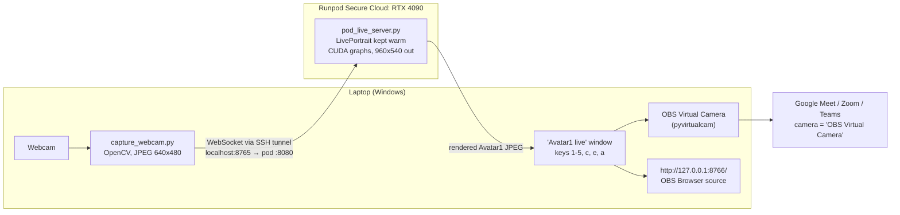

# Funny Meme Live Face/Body Swap: Avatar1

Real-time "meme avatar" for video calls. You sit at your laptop, and on Google Meet or Zoom
people see **Avatar1**, a silver-haired character, copying your expressions live. The heavy
GPU work runs on a rented **Runpod Secure Cloud** GPU. Your laptop only captures the webcam and
shows the result through the **OBS Virtual Camera**.

> Built Sep 24 – Oct 8, 2026 on a laptop with no NVIDIA GPU (HP ENVY, i7-1255U, Iris Xe).
> Face: live at about 20 fps. Body: LoRA trained, live version next.

## Status

| Part | Status | Notes |
|---|---|---|
| Face live (LivePortrait on Runpod → OBS Virtual Camera) | ✅ **Done** | About 20 fps, about 150 ms delay over an SSH tunnel. Tested in Google Meet |
| Face switching (5 looks on keys 1–5) | ✅ **Done** | 4 clean looks + 1 neck-tattoo look |
| Body LoRA (SD1.5, 5 body styles) | ✅ **Trained** | About 30 min on an A40, about $0.29. Main + Hourglass are the focus |
| Body live (webcam pose → ControlNet + LoRA) | ✅ **v1** | About 7–8 fps, about 230 ms on a 4090, full body plus back view. See [`live/body/`](live/body/README.md) |
| Voice changer, mobile | 💡 Concept | See [VOICE](docs/VOICE.md) and [MOBILE](docs/MOBILE.md) |

## How it works



Body path (trained, not live yet): webcam → OpenPose skeleton → SD1.5 + ControlNet OpenPose +
Avatar1 body LoRA (`avtr1 woman, av1main` …) → frame.

## Quick start (face, live)

1. **Start a pod.** Runpod Secure Cloud, RTX 4090, official ComfyUI template, with auto-terminate set.
   On the pod, run:
   ```bash
   curl -fsSL https://raw.githubusercontent.com/pjrny/funnymemelivefacebodyswap/main/runpod/bootstrap_avatar_pod.sh | bash
   ```
2. **Upload the face photos** to `/workspace/avatar1/clean/` and `/workspace/avatar1/necktattoo_front.jpg`
   (they're not in git). See [USAGE → Restore](docs/USAGE.md#7-restore-the-face-photos-on-a-new-pod).
3. **Start the live server.** Copy `live/` to `/workspace/live/`, then run `/workspace/live/start_live_server.sh`
   and wait for `[live] ready`.
4. **On the laptop**, fill in `live\live_config.json` (pod IP, SSH port, token) and double-click `live\start_live.bat`.
5. Hold a neutral face and press **c**. In Meet or Zoom, pick the camera **OBS Virtual Camera**.
6. **When you're done, terminate the pod.**

Full walkthrough: **[docs/USAGE.md](docs/USAGE.md)**

## Keys in the "Avatar1 live" window

| Key | Action |
|---|---|
| `1` | Slicked silver ponytail (`clean_03`), the favorite and default |
| `2` | Smirk bun (`clean_06`) |
| `3` | Silver bun (`clean_01`) |
| `4` | Parted-lips bun (`clean_05`) |
| `5` | Neck-tattoo avatar (`necktattoo_front`) |
| `c` | Calibrate (hold a neutral face). **Press after every switch** |
| `e` / `a` | Expression only (sharp) / expression + head pose (tattoos smear) |
| `+` / `-` | More / less motion |
| `q` | Quit |

Planned body keys: **1 Main**, **2 Hourglass** (see [USAGE §6](docs/USAGE.md#6-switch-bodies-planned)).

## Documentation

| Doc | What's in it |
|---|---|
| [HOW_WE_BUILT_IT](docs/HOW_WE_BUILT_IT.md) | The story: laptop experiments → Runpod → live face → body LoRA, with the numbers |
| [USAGE](docs/USAGE.md) | Step by step: pod, live server, laptop, Meet/Zoom, switching, shutdown, training |
| [TROUBLESHOOTING](docs/TROUBLESHOOTING.md) | Every issue we hit: symptom → cause → fix |
| [BEST_PRACTICES](docs/BEST_PRACTICES.md) | Best versions, lighting, framing, network, privacy, cost, responsible use |
| [OPTIMIZATION](docs/OPTIMIZATION.md) | Roadmap for cost, speed, and accuracy |
| [MOBILE](docs/MOBILE.md) | Using it with phone calls: Zoom/Meet mobile, WhatsApp, FaceTime |
| [VOICE](docs/VOICE.md) | Voice changer concepts: ElevenLabs, Ableton Live 11, local RVC |

## Repo layout

| Folder | What |
|---|---|
| [`runpod/`](runpod/README.md) | Pod bootstrap: LivePortrait + weights + helpers |
| [`live/`](live/README.md) | Realtime pipeline: pod server, laptop capture client, launchers |
| [`train/`](train/README.md) | Body LoRA: pod bootstrap, dataset builder, kohya training, test renders, speed bench |
| [`docs/`](docs/) | Project documentation |

**Not in git, on purpose:** avatar photos, videos, the dataset, LoRA weights, `live_config.json`,
and the live token. Keep those local (see [BEST_PRACTICES → Privacy](docs/BEST_PRACTICES.md#privacy)).

## Costs so far

The whole project, including setup, live testing, and body training, used about **$2.60** of Runpod credit
(the balance went from about $10 to $7.41). Live sessions cost about $0.74/hr on a Secure Cloud RTX 4090.

## Responsible use

This is for fun with people who know it's an avatar. Don't use it to impersonate real people or to deceive
anyone, and follow the rules of the platform you're on. See [BEST_PRACTICES](docs/BEST_PRACTICES.md#responsible-use).

MIT licensed. See [LICENSE](LICENSE).
